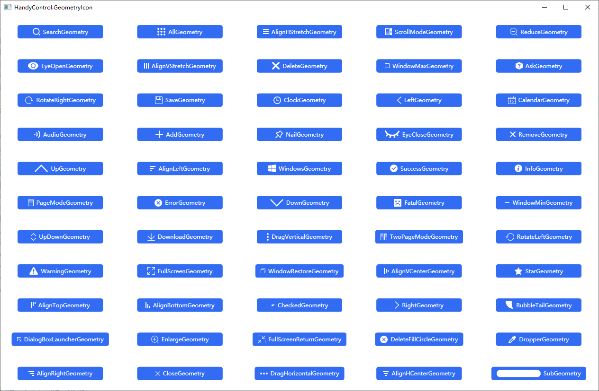

# HandyControl.Geometry
 
 [HandyControl](https://gitee.com/handyorg/HandyControl)

 [HandyControl中文文档](https://handyorg.github.io/handycontrol/)

 HandyControl 按钮所用的图标，详见 https://handyorg.github.io/handycontrol/basic_xaml/geometries/
 由于作者提供的图标只有名称没有具体的图形，所以写了个界面来呈现作者提供的图标，以做到见名知图。

 

 使用方式：

 按钮的 xaml 代码如下：

 ```XAML
 <Button hc:IconElement.Geometry="{StaticResource InfoGeometry}" Style="{StaticResource ButtonPrimary}" />
 ```

 只要把 **InfoGeometry** 替换成作者提供的图标名称即可。

 Tips:点击按钮后会把图标的名称复制到剪贴板，方便粘贴到xaml代码中。